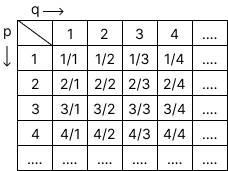
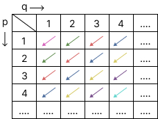
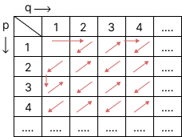

# Finding nth element in Cantor's sequence
## Algorithm description
George Cantor in one of his proofs used this sequence of rational numbers: 

**There are many ways to order/enumerate those expressions.**
* In cantor_sequence.js file I used this approach: 
 
So the numbers in this order will go like this: 1/1, 1/2, 2/1, 1/3, 2/2, 3/1, 1/4, ...
* In cantor_snake.js file I used this approach: 
 
So the numbers in this order will go like this: 1/1, 1/2, 2/1, 3/1, 2/2, 1/3, 1/4, ...

**These algorithms let us find the nth element of following sequences.**